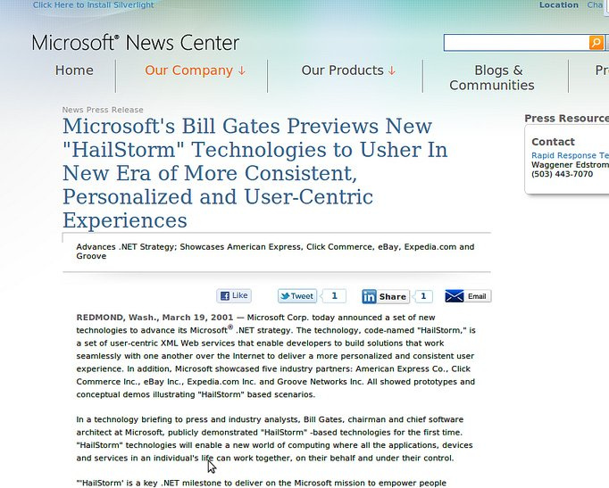

!SLIDE center
# User-Centric?

!SLIDE bullets incremental
# User-Centric Identity
### Kaliya Hamlin
* Freedom to be who you want to be online - the right to anonymity and pseudonymity.
* The ability to share more specific validated information about yourself.
* The ability to curate the information about yourself found online.

!SLIDE bullets incremental
# Important Question
* Who owns my identifier and do I trust the owner?

