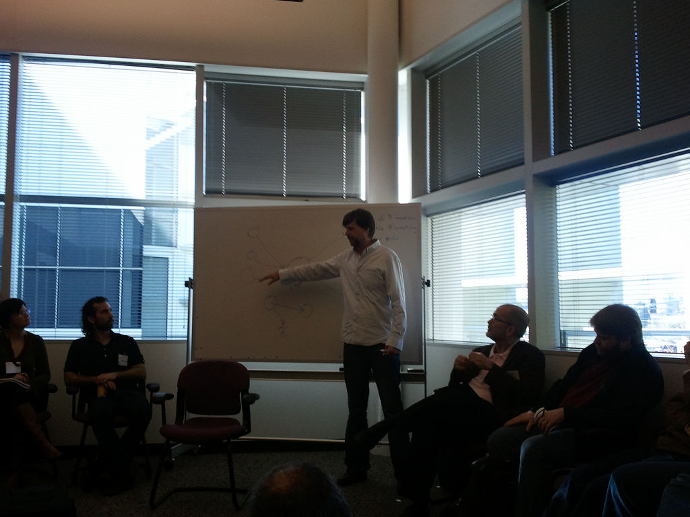
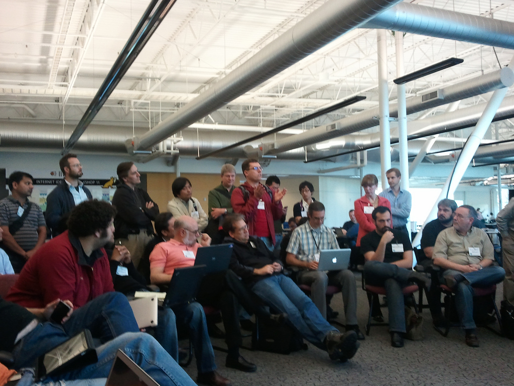

!SLIDE bullets incremental
# [Decline of User-Centric Identity](http://iiw.idcommons.net/Decline_of_User-Centric_Identity)

!SLIDE full-page

!SLIDE full-page

!SLIDE bullets incremental
#OpenID Connect
* OpenID Connect is not a user-centric architecture
* [Mailing List Archives](http://lists.openid.net/pipermail/openid-specs-ab/)

!SLIDE bullets incremental
# User-Centric Identity is far from dead
## It is just getting started
* [Kaliya Hamlin March 23, 2011](http://www.identitywoman.net/user-centric-identity-is-far-from-dead-it-just-getting-started)

