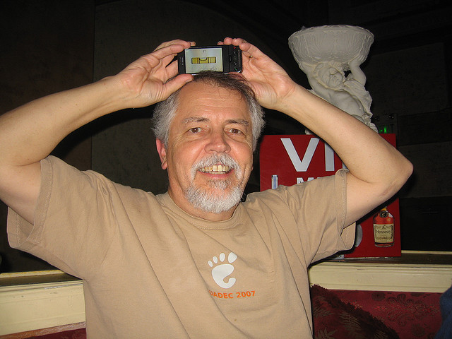

!SLIDE center
# Market Failure
### Doc Searls: It’s time for us to stop acting like an audience and start acting like a market

[photo by Mary Hodder](http://www.flickr.com/photos/maryhodder/3025770866/)

!SLIDE bullets
# User-Centric Initiatives
* [OStatus](http://ostatus.org/)
* [User-Managed Access (UMA)](http://kantarainitiative.org/confluence/display/uma/Home)
* [Vendor Relationship Management](http://cyber.law.harvard.edu/projectvrm/Main_Page)
